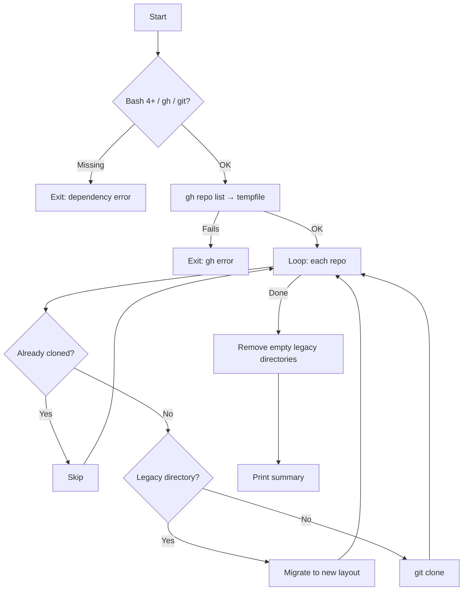

<p align="center">
  
</p>

<h1 align="center">clone-gh-repos</h1>

<p align="center">
  <strong>Clone every repository from a GitHub account. Organised by visibility and language. Ready in seconds.</strong>
</p>

<p align="center">
  <a href="https://github.com/sebastienrousseau/clone-gh-repos/actions"></a>
  <a href="https://github.com/sebastienrousseau/clone-gh-repos/releases/latest"></a>
  <a href="LICENSE"></a>
</p>

---

## Overview

One script. Every repo. A clean local tree.

Run it once to clone an entire GitHub account. Run it again — only new repositories are fetched. Existing ones stay untouched.

```
~/Code/
├── Public/
│   ├── rust/
│   │   └── my-crate/
│   ├── typescript/
│   │   └── my-app/
│   └── other/
│       └── dotfiles/
└── Private/
    └── python/
        └── internal-tool/
```

Private repositories require a `gh` token with appropriate access. Public repositories from any account are always available.

---

## Get Started

### 1. Install the prerequisites

| Tool | macOS | Linux and WSL |
|:-----|:------|:--------------|
| Bash 4+ | `brew install bash` | Pre-installed |
| [Git](https://git-scm.com/) | `brew install git` | `sudo apt install git` |
| [GitHub CLI](https://cli.github.com/) | `brew install gh` | `sudo apt install gh` |

### 2. Authenticate with GitHub

```bash
gh auth login
```

### 3. Clone

```bash
./clone-gh-repos.sh <owner> [base_dir] [limit]
```

| Parameter | Required | Default | Description |
|:----------|:---------|:--------|:------------|
| `owner` | Yes | — | GitHub username or organisation |
| `base_dir` | No | `$HOME/Code` | Root directory for the cloned tree |
| `limit` | No | `1000` | Maximum repositories to fetch |

Clone a personal account:

```bash
./clone-gh-repos.sh my-username
```

Clone an organisation into a custom directory:

```bash
./clone-gh-repos.sh my-org ~/Projects 500
```

---

## Features

| | |
|:---|:---|
| **Idempotent** | Safe to re-run. Already-cloned repositories are skipped. |
| **Organised** | Repositories sort into `Public/` and `Private/` trees by language. |
| **Migratory** | Flat `~/Code/<Language>/` layouts from earlier runs move into the new structure on the next run. |
| **Cross-platform** | Works on macOS, Linux, and WSL2. LF line endings enforced. |
| **Portable** | No hardcoded paths or usernames. Works for any GitHub account. |
| **Fail-safe** | Pre-flight checks for `gh`, `git`, and Bash version. Clear error messages on failure. |

---

## How It Works



---

## Legacy Migration

Earlier versions of this script stored repositories in a flat `~/Code/<Language>/<repo>` layout. When the script encounters these directories, it moves them into the new `<Visibility>/<Language>/<repo>` structure. Empty legacy language folders are removed afterward.

---

## Troubleshooting

| Message | Cause | Solution |
|:--------|:------|:---------|
| `ERROR: Bash 4+ is required` | macOS includes Bash 3.2 by default | `brew install bash` |
| `ERROR: Required command 'gh' not found` | GitHub CLI is not installed | See Get Started above |
| `ERROR: gh repo list failed` | Not authenticated, or the owner does not exist | Run `gh auth login` and verify the owner name |
| `FAILED: owner/repo` | Network issue or protocol mismatch | Check connectivity. Run `gh config set git_protocol https` |
| Script reports 0 repos | No repositories visible to the current token | Run `gh repo list <owner> --limit 5` to verify |

---

## Contributing

See [CONTRIBUTING.md](CONTRIBUTING.md).

---

## License

Released under the [GNU General Public License v3.0](LICENSE).

<p align="right"><a href="#clone-gh-repos">Back to Top</a></p>
