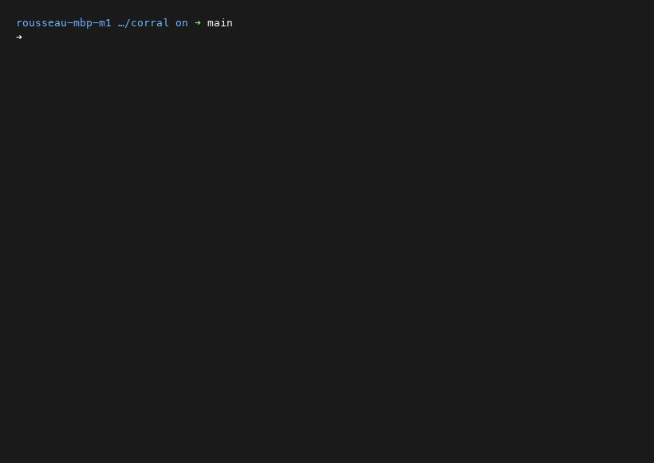

<!-- SPDX-License-Identifier: Apache-2.0 OR MIT -->

<p align="center">
  
</p>

<h1 align="center">Corral</h1>

<p align="center">
  Automatically clone and organise GitHub repositories by visibility and language.
</p>

<p align="center">
  <a href="https://github.com/sebastienrousseau/corral/actions"></a>
  <a href="https://github.com/sebastienrousseau/corral/releases/latest"></a>
  <a href="LICENSE"></a>
</p>

<p align="center">
  
</p>

---

## Contents

**Getting started**

- [Install](#install) — Homebrew, Arch, source, or Docker
- [Quick Start](#quick-start) — clone and organise in one command

**Features & Capabilities**

- [Features](#features) — structured layout, concurrency, and security
- [Interactive TUI Mode](#interactive-tui-mode) — keybindings, commands, and autocomplete
- [Layout Customization](#layout-customization) — templated visibility and language organization
- [Smart Syncing](#smart-syncing) — network-optimised incremental updates
- [Exec Mode](#exec-mode) — concurrent batch execution of Git commands

**Reference & Operational**

- [Usage & Flags](#usage--flags) — complete CLI parameter reference
- [Examples](#examples) — index of runnable programmatic examples
- [Troubleshooting](#troubleshooting) — quick solutions to common errors
- [Frequently Asked Questions](#frequently-asked-questions) — design decisions and Windows/WSL support
- [License](#license)

---

## Install

### Homebrew (macOS / Linux)

```bash
brew install sebastienrousseau/tap/corralctl
```

### Arch Linux (AUR)

```bash
yay -S corralctl-bin    # or: paru -S corralctl-bin
```

### Build from source

Requires Go 1.26+ and Git:

```bash
git clone https://github.com/sebastienrousseau/corral.git
cd corral
make build              # compiles ./corralctl
```

### Platform Prerequisites

<details>
<summary><b>macOS</b></summary>

```bash
brew install go git gh
```
</details>

<details>
<summary><b>Ubuntu / Debian / WSL2</b></summary>

```bash
sudo apt install golang git
```

Install `gh` separately following the [GitHub CLI installation guide](https://github.com/cli/cli/blob/trunk/docs/install_linux.md).
</details>

<details>
<summary><b>Fedora / RHEL</b></summary>

```bash
sudo dnf install golang git gh
```
</details>

---

## Quick Start

Run Corral with an owner name (GitHub username or organization) to clone and automatically sort all repositories into a clean local directory hierarchy:

```bash
# Log in to GitHub CLI first (or set GITHUB_TOKEN)
gh auth login

# Run Corral for your profile
./corralctl my-username
```

This converges your local directory structure into a structured mirror:

```
~/Code/
├── Public/
│   ├── go/
│   │   └── corral/
│   ├── rust/
│   │   └── my-crate/
│   └── other/
│       └── dotfiles/
└── Private/
    └── python/
        └── internal-tool/
```

---

## Features

| Feature | Description |
| :--- | :--- |
| **Structured Layout** | Automatically sorts repositories into `Public/` and `Private/` trees, sub-grouped by primary language (e.g. `go`, `rust`, `python`). |
| **Smart Syncing** | Compares remote `pushed_at` metadata to skip redundant network calls, speeding up syncs by 10x-50x. |
| **Interactive Selection** | A fully featured Terminal UI (TUI) selector dashboard to search, preview, and select repositories to clone. |
| **Legacy Migration** | Automatically moves existing flat directory layouts into the new structure and cleans up empty folders. |
| **Concurrency** | Processes clones and pulls concurrently with configurable worker limits (`--concurrency`). |
| **Batch Commands** | Batch execute Git commands concurrently across all cloned repositories using `exec`. |
| **Zero Configuration** | No configuration files required — simple, sensible defaults that work out of the box. |

---

## Interactive TUI Mode

By passing the `-i` or `--interactive` flag, you can launch the selection dashboard:

```bash
./corralctl -i my-username
```

### Keybindings

- `[space]` — Toggle selection of the current repository.
- `[ctrl+a]` — Select all currently filtered repositories.
- `[ctrl+n]` — Deselect all currently filtered repositories.
- `[/]` — Enter command / filter mode.
- `[enter]` — Confirm selection and begin cloning/syncing.
- `[esc]` — Exit the application silently.

### In-Session Commands

Press `/` inside the TUI to enter Command Mode. Commands support prefix-based autocompletion (press `[tab]` or `[right-arrow]` to autocomplete):

- `/sort <field>` — Sort repositories. Fields:
  - `name` — Alphabetical sort by repository name.
  - `language` / `lang` — Alphabetical sort by language.
  - `visibility` / `vis` — Alphabetical sort by visibility (Private/Public).
  - `public` — Prioritize public repositories at the top.
  - `private` — Prioritize private repositories at the top.
- `/all` — Select all filtered repositories.
- `/none` — Deselect all filtered repositories.
- `/exit` / `/quit` — Cancel and exit silently.
- `/help` — Display the in-session help panel overlay.

---

## Layout Customization

By default, Corral uses the layout `{{.Visibility}}/{{.Language}}/{{.Name}}`. You can override this using the `--layout` flag:

```bash
./corralctl --layout "{{.Owner}}/{{.Name}}" my-org
```

Supported placeholders:
* `{{.Owner}}` — GitHub owner name.
* `{{.Name}}` — Repository name.
* `{{.Language}}` — Primary language normalized to lowercase.
* `{{.Visibility}}` — Repository visibility (`Public` or `Private`).

---

## Smart Syncing

Corral stores synchronization metadata next to each repository's `.git/` folder inside a `.corral-state.json` sidecar file:
* **No Redundant Pulls:** If the remote repository has not received new pushes since the last sync, `git pull` is skipped completely.
* **Overrides:** To bypass smart checks and force Corral to perform a full `git pull`, pass the `--force-sync` flag.
* **Skip Syncing entirely:** Pass `--no-sync` to skip updates on all cloned repositories.

---

## Exec Mode

Execute arbitrary shell commands concurrently across your organized repositories:

```bash
# Check git status for all Go/Rust private repositories
./corralctl exec "git status -s" --languages go,rust --visibility private
```

---

## Usage & Flags

### Positional Arguments

```bash
corralctl <owner> [base_dir] [limit]
```

- `<owner>` — GitHub username or organization (Required).
- `[base_dir]` — Root directory to save repositories (Default: `$HOME/Code`).
- `[limit]` — Maximum repositories to fetch (Default: `1000`).

### Command Options

| Option | Short | Default | Description |
| :--- | :--- | :--- | :--- |
| `--base-dir` | — | `$HOME/Code` | Root directory for cloned repos |
| `--limit` | `-l` | `1000` | Maximum repositories to fetch |
| `--concurrency` | `-c` | `1` | Number of concurrent worker threads |
| `--dry-run` | `-n` | off | Preview actions without making changes |
| `--orphans` | `-o` | off | Detect local repositories no longer on GitHub |
| `--protocol` | `-p` | `https` | Protocol to clone: `ssh` or `https` |
| `--no-sync` | — | off | Skip pulling latest changes for existing clones |
| `--force-sync` | — | off | Force git pull regardless of cached state |
| `--layout` | — | `...` | Templated path layout for repositories |
| `--interactive` | `-i` | off | Launch the interactive selector TUI dashboard |
| `--recurse-submodules`| — | off | Initialise submodules on clone and sync |
| `--output` | — | `text` | Output format: `text`, `json`, or `ndjson` |
| `--auth` | — | `auto` | Auth mode: `auto`, `token`, or `gh` |
| `--visibility` | — | `all` | Filter by visibility: `all`, `public`, `private` |
| `--include-forks` | — | off | Include forked repositories |
| `--include-archived` | — | off | Include archived repositories |
| `--languages` | — | — | Comma-separated language filter (e.g. `go,rust`) |
| `--exclude-languages`| — | — | Comma-separated language exclude list |
| `--clone-depth` | — | `0` | Shallow clone depth (`0` disables shallow clone) |

---

## Examples

To inspect the package layout and programmatically run Corral modules, see the self-contained, copy-pasteable Go code examples in the [examples](file:///Users/seb/Code/Public/go/corral/examples) directory:

1. **[Interactive Selector](file:///Users/seb/Code/Public/go/corral/examples/interactive_selector/main.go)** — Programmatically configure and launch the selection checklist TUI in AltScreen mode.
2. **[GitHub Repository Fetcher](file:///Users/seb/Code/Public/go/corral/examples/github_fetch/main.go)** — Query the GitHub REST API using `github.FetchReposWithOptions` with stars sorting and language constraints.
3. **[Git Syncing](file:///Users/seb/Code/Public/go/corral/examples/git_clone/main.go)** — Call the `git` helper package to perform clones, query branches, and resolve origin URLs.
4. **[Engine Orchestrator](file:///Users/seb/Code/Public/go/corral/examples/engine_run/main.go)** — Integrate the core engine `engine.Run` to run repository syncing with custom filters, layout structures, and dry-run pre-flights.

---

## Troubleshooting

| Error Message | Cause | Solution |
| :--- | :--- | :--- |
| `ERROR: git not found on PATH` | Git is not installed or missing from the current PATH environment. | Install git via your package manager. |
| `ERROR: GITHUB_TOKEN environment variable not set` | `--auth token` was specified but no environment variable is present. | Run `export GITHUB_TOKEN=$(gh auth token)` or switch to `--auth auto`. |
| `FAILED: owner/repo` | Authentication error or network failure during clone/pull. | Check connectivity and confirm `gh auth status` displays a valid session. |

---

## Frequently Asked Questions

- **Does it work with GitLab or other hosts?**  
  No. Corral is specifically built to integrate with the GitHub API and GitHub CLI (`gh`).
- **What happens to repositories deleted on GitHub?**  
  Corral never deletes your local checkouts. To see repositories that no longer exist upstream, run Corral with the `--orphans` flag.
- **Can I run it inside Cron or systemd timers?**  
  Yes. The command runs non-interactively by default. All Git command credential prompts are bypassed to ensure automated jobs never hang.
- **How are repositories with no primary language stored?**  
  They default to the `other/` language category (e.g. `Public/other/my-repo`).

---

**THE ARCHITECT** ᛫ [Sebastien Rousseau](https://sebastienrousseau.com)  
**THE ENGINE** ᛞ [EUXIS](https://euxis.co) ᛫ Enterprise Unified Execution Intelligence System

---

## License

Licensed under the **[GNU General Public License v3.0](LICENSE)**.

<p align="right"><a href="#corral">Back to Top</a></p>
