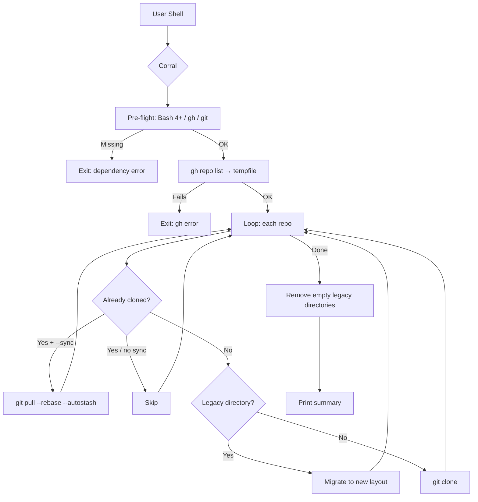

<p align="center">
  
</p>

<h1 align="center">Corral</h1>

<p align="center">
  <strong>The only GitHub cloning tool that organises repositories by visibility and language on macOS, Linux, and WSL2 — automatically.</strong>
</p>

<p align="center">
  <a href="https://github.com/sebastienrousseau/Corral/actions"></a>
  <a href="https://github.com/sebastienrousseau/Corral/releases/latest"></a>
  <a href="LICENSE"></a>
</p>

---

## Install

```bash
git clone https://github.com/sebastienrousseau/Corral.git
cd Corral
gh auth login
./corral.sh <owner>
```

Then verify the output:

```bash
ls ~/Code/
```

Requires `gh`, `git`, and Bash 4+. Works on macOS, Ubuntu/Debian, Fedora/RHEL, Arch, and WSL2.

<details>
<summary>Platform-specific prerequisites</summary>

**macOS:**

```bash
brew install bash git gh
```

macOS ships with Bash 3.2. After installing Bash 4+ via Homebrew, ensure it appears first in your `$PATH` or invoke the script explicitly: `/opt/homebrew/bin/bash corral.sh <owner>`.

**Ubuntu / Debian / WSL2:**

```bash
sudo apt install git
```

Install `gh` separately — see the [GitHub CLI install guide](https://github.com/cli/cli/blob/trunk/docs/install_linux.md) for your distribution.

**Fedora / RHEL:**

```bash
sudo dnf install git gh
```

> **WSL2 users:** Run all commands inside your Linux distribution, not from PowerShell or CMD. The script works identically to native Linux.

</details>

<details>
<summary>Automation and cron</summary>

The script is idempotent and non-interactive. Safe to run on a schedule:

```bash
# crontab -e
0 2 * * * /path/to/corral.sh my-username
```

Existing repositories are skipped. Only new ones are cloned.

</details>

---

## Overview

Most cloning tools dump every repository into a single flat directory. Finding anything means scrolling through hundreds of folders with no structure. Corral creates a clean, navigable local mirror — sorted by visibility and language — in one command. One script. No install step. No config files. No runtime dependencies beyond `gh` and `git`.

```
~/Code/
├── Public/
│   ├── rust/
│   │   └── my-crate/
│   ├── typescript/
│   │   └── my-app/
│   └── other/
│       └── dotfiles/
└── Private/
    └── python/
        └── internal-tool/
```

- **One command** to clone and organise every repository from a user or organisation
- **Safe to re-run** at any time — new repos are cloned, existing ones are untouched (or pulled if `--sync` is active)
- **Automatic migration** from flat `~/Code/<Language>/` layouts to the new visibility-based structure
- **Tested on macOS and Ubuntu** with 39 automated tests, signed commits, and ShellCheck compliance

---

## Architecture

Run once or a hundred times, the directory tree converges on the same state.



---

## Features

| | |
| :--- | :--- |
| **Structured** | The only tool that sorts repositories into `Public/` and `Private/` trees, grouped by primary language |
| **Idempotent** | Safe to re-run at any time — already-cloned repositories are skipped, only new ones are fetched |
| **Migratory** | Flat `~/Code/<Language>/` layouts from earlier runs move into the new structure automatically |
| **Platforms** | First-class support for macOS, Ubuntu/Debian, Fedora/RHEL, Arch, and Windows via WSL2 |
| **Zero-config** | No YAML, no `.env`, no config files — pass the owner name and run |
| **Fail-safe** | Pre-flight checks for `gh`, `git`, and Bash version with clear error messages on failure |
| **Production-grade** | 39 automated tests, CI on Ubuntu and macOS, signed commits, ShellCheck clean |
| **Security** | All commits cryptographically signed (ED25519), CI actions pinned to immutable SHAs, Gitleaks secret scanning |

---

## Usage

| Parameter | Required | Default | Description |
| :--- | :--- | :--- | :--- |
| `owner` | Yes | — | GitHub username or organisation |
| `base_dir` | No | `$HOME/Code` | Root directory for the cloned tree |
| `limit` | No | `1000` | Maximum repositories to fetch |

| Option | Short | Default | Description |
| :--- | :--- | :--- | :--- |
| `--dry-run` | `-n` | off | Preview actions without making changes |
| `--help` | `-h` | — | Show help message |
| `--protocol` | `-p` | `https` | Clone protocol — `ssh` or `https` |
| `--sync` | `-s` | off | Pull latest changes for already-cloned repos |

Clone a personal account:

```bash
./corral.sh my-username
```

Clone an organisation into a custom directory:

```bash
./corral.sh my-org ~/Projects 500
```

Clone via SSH (key-based auth):

```bash
./corral.sh --protocol ssh my-username
```

Keep existing clones up to date:

```bash
./corral.sh --sync my-username
```

Preview what would happen without making changes:

```bash
./corral.sh --dry-run my-org
```

Private repositories require a `gh` token with appropriate access. Public repositories from any account are always available.

---

## What's Included

<details>
<summary><b>Organisation and Layout</b></summary>

- **Visibility sorting** separates repositories into `Public/` and `Private/` trees based on GitHub metadata
- **Language grouping** places each repository under its primary language directory, normalised to lowercase
- **Special characters** are handled cleanly — C# becomes `csharp`, C++ becomes `cpp`, spaces and slashes become underscores
- **Null languages** default to `other/` so every repository has a home
</details>

<details>
<summary><b>Legacy Migration</b></summary>

- **Flat layouts** from earlier versions (`~/Code/<Language>/<repo>`) are detected and moved into the new `<Visibility>/<Language>/<repo>` structure
- **Empty directories** left behind after migration are removed automatically
- **Existing clones** are never overwritten or deleted — the script only adds, never subtracts
</details>

<details>
<summary><b>Troubleshooting</b></summary>

| Message | Cause | Solution |
| :--- | :--- | :--- |
| `ERROR: Bash 4+ is required` | macOS includes Bash 3.2 by default | `brew install bash` |
| `ERROR: Required command 'gh' not found` | GitHub CLI is not installed | See Install above |
| `ERROR: gh repo list failed` | Not authenticated, or the owner does not exist | Run `gh auth login` and verify the owner name |
| `FAILED: owner/repo` | Network issue or private repo without token access | Check connectivity and verify `gh auth status` |
| Script reports 0 repos | No repositories visible to the current token | Run `gh repo list <owner> --limit 5` to verify |
| `\r: command not found` (WSL2) | Windows line endings in the script | Run `dos2unix corral.sh` or re-clone with `git config core.autocrlf input` |
</details>

<details>
<summary><b>Frequently Asked Questions</b></summary>

- **Can it back up private repositories?** Yes. Any repository visible to the authenticated `gh` token is cloned. Private repositories land in the `Private/` tree.
- **Does it work with organisations?** Yes. Pass the organisation name as the first argument. Both user accounts and organisations are supported.
- **What happens if a repository is deleted on GitHub?** The local clone remains untouched. The script never deletes existing directories.
- **Does it work on Windows?** Yes, through WSL2. Install a Linux distribution from the Microsoft Store, open its terminal, and run the script there. It behaves identically to native Linux.
- **Does it work on macOS with the default shell?** macOS ships with Bash 3.2. Run `brew install bash` to get Bash 4+, then invoke the script with the Homebrew-installed Bash or add it to your `$PATH`.
- **Is it safe to run on a schedule?** Yes. The script is idempotent — existing repos are skipped, only new ones are cloned. No interactive prompts.
</details>

<details>
<summary><b>How It Compares</b></summary>

| Feature | Corral | [ghorg](https://github.com/gabrie30/ghorg) | [ghcloneall](https://pypi.org/project/ghcloneall/) | Gist scripts |
| :--- | :--- | :--- | :--- | :--- |
| Organises by language | Yes | No | No | No |
| Organises by visibility | Yes | No | No | No |
| macOS, Linux, and WSL2 | Yes (CI on both) | Yes | Linux only | Varies |
| Zero install | Yes (single bash file) | Go binary or Docker | Python + pip | Copy-paste |
| Idempotent re-runs | Yes | Yes | Yes | No |
| Legacy layout migration | Yes | No | No | No |
| Test suite | 39 tests, CI on 2 OS | Yes | Limited | None |
| Config required | None | YAML + env vars | CLI flags + rc file | Manual edits |
</details>

For security policy and vulnerability reporting, see [SECURITY.md](SECURITY.md).

---

**THE ARCHITECT** ᛫ [Sebastien Rousseau](https://sebastienrousseau.com)
**THE ENGINE** ᛞ [EUXIS](https://euxis.co) ᛫ Enterprise Unified Execution Intelligence System

---

## License

Licensed under the **[GNU General Public License v3.0](LICENSE)**.

<p align="right"><a href="#corral">Back to Top</a></p>
